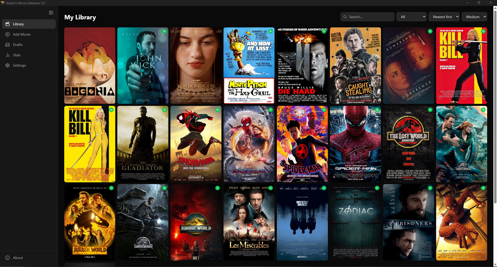

# Robert's Movie Database 2.0 🎬🍿

A desktop app to manage your personal movie library — search, rate, and track what you've watched.



## Features

- Browse and search your movie library
- Add movies manually or by scanning local folders
- Save drafts for movies you're considering adding
- Rate movies with a star system
- Mark movies as watched / unwatched
- View library stats (total movies, average rating, watch percentage)
- Fetch movie posters and metadata from external APIs

## Tech Stack

| Layer | Technology |
|---|---|
| Desktop shell | [Tauri v2](https://tauri.app/) |
| Frontend | React + TypeScript + Vite |
| Backend (sidecar) | [Elysia](https://elysiajs.com/) running on [Bun](https://bun.sh/) |
| Database | SQLite via `bun:sqlite` + [Drizzle ORM](https://orm.drizzle.team/) |
| Type safety | Eden Treaty (end-to-end typed API client) |

## Project Structure

```
├── apps/
│   ├── api/        # Elysia REST API (runs as a Tauri sidecar)
│   └── desktop/    # Tauri + React desktop app
└── libs/
    └── ts-config/  # Shared TypeScript configurations
```

## Development

Requires [Bun](https://bun.sh/) and the [Tauri prerequisites](https://tauri.app/start/prerequisites/) for your OS.

```bash
# Install dependencies
bun install

# Run the API in watch mode
bun run api:dev

# Run the desktop app (Tauri dev window)
bun run desktop:dev
```

### Database setup (first time)

```bash
cd apps/api
bun run setup   # generate migrations → run migrations → build
```

## Building a release

```bash
bun run release:build
```

This bundles the API as a sidecar binary and builds the Tauri app installer.

## About this project

A personal portfolio project developed with [Claude Code](https://claude.ai/code) as an AI assistant. Architecture decisions, tech stack choices, and product design are mine — implementation was written in collaboration with AI.
